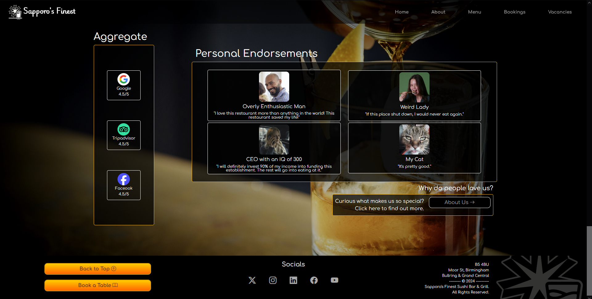
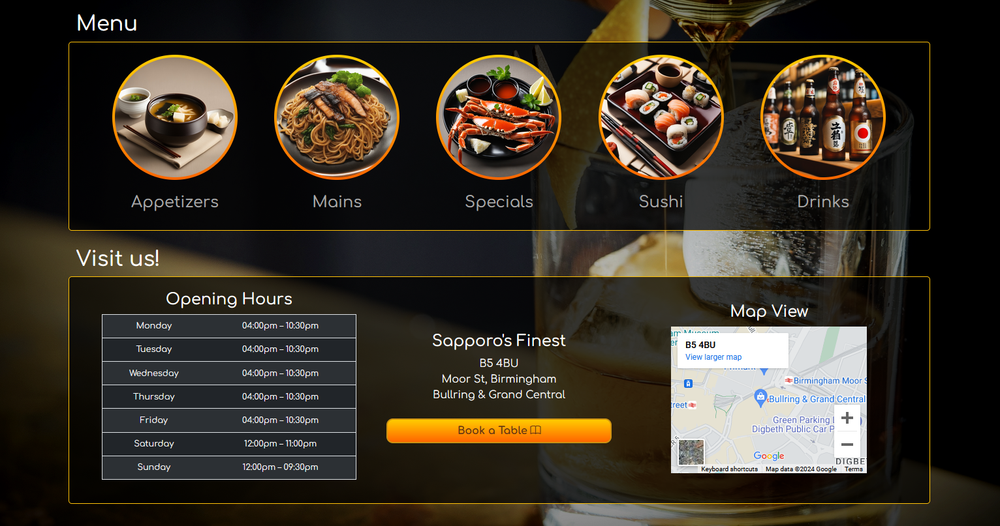

# Sapporo's Finest - [Live Website ⧉](https://flavopila.github.io/msp1)

  

# Overview
 This is the repository for my fictional sushi bar and barbecue restaurant website project. It is my first milestone project (of 4 total) in my web development course. It will serve to showcase my ability to use HTML and CSS.  

 The goals of this project revolve around creating a responsive website with multiple sections and navigation links, with a focus on user experience design and implementation of both HTML and CSS to achieve a web-valid and also presentable design. I also opted to make use of technologies such as bootstrap to aid me in the structural design and other tools to aid in styling my pages, which I will list in the next part of this readme.

# Built Using

### Languages
HTML/CSS - Building site structure and implementing styles  
JavaScript (code not created by me, only [edited](#javascript) somewhat)  

### Tools
Browser dev tools - Test responsiveness to different screen sizes  
Gitpod/Code Institute IDE - Create, edit, and preview my code  
[Github/Github Pages](https://github.com) - Hosting repository and live website  
[W3C HTML Validation Service](https://validator.w3.org) - Check validity of HTML  
[W3C CSS Validation Service](https://jigsaw.w3.org/css-validator) - Check validity of CSS  
[Bootstrap](https://getbootstrap.com) - Layout & Icons  
[Google Fonts](https://fonts.google.com) - Fonts  
[Animate.css](https://animate.style) - Animating some parts of the page   
[Pexels.com](https://www.pexels.com) - Free stock images  
[DeepAI](https://deepai.org/machine-learning-model/text2img) - Generating a few low res images   

# User Experience
### User Stories  
#### Client/Owner Goals
- To accrue more customers effectively through a simple and intuitive booking system which is easy to locate
- To have a responsive website that all manner of users can view, on a wide range of devices
- To display food and drink menus upfront, so users do not have to spend time and mental bandwith searching for it 
- To have intuitive navigation without heavy reliance on user being technologically aware (i.e. no use of built in browser navigation)
- To have easily accessible and also somehow advertised vacancy opportunities, ensuring people are interested in applying and know how to do so
- To let users know where to find us on social media as well as in person  
#### First Time Visitor Goals 
- To find out where the restaurant is and when it is open 
- To easily find the menu, to see if I want to eat there
- To see pictures of the establishment and the food available so I can get a feeling for the quality and atmosphere
- To be able to easily find the bookings page and be able to carry out a booking without any hassle when I have decided what I want to eat
#### Returning Visitor Goals
- To quickly view the menus 
- To quickly book a table
- To learn more about the restaurant 

### User Story Implementation

| Client's / Owner's Goals | Implementation | Result |
| --- | --- | --- |
| To accrue more customers effectively through a simple and intuitive booking system which is easy to locate | Always visible navbar contains link to bookings page; bookings page has a simple form to fill out with contact details and date & time of booking. | Achieved |
| To have a responsive website that all manner of users can view, on a wide range of devices | Use of media queries and bootstrap's responsive structuring allows for responsive content; optimizations have been made for better performance on weaker devices. | Achieved |
| To display food and drink menus upfront, so users do not have to spend time and mental bandwith searching for it  | First section after hero image contains links to menu categories with AI generated icons to give a sense for the category contents at a glance. | Achieved |
| To have intuitive navigation without heavy reliance on user being technologically aware (i.e. no use of built in browser navigation) | Several navigation points across page; navbar at top always visible, as well as navigation being implemented throughout page content and footer, in plain view. Homepage is designed to show most relevant and desired information first. | Achieved |
| To have easily accessible and also somehow advertised vacancy opportunities, ensuring people are interested in applying and know how to do so | Homepage contains a section that showcases the restaurant's working environment through an image gallery; underneath gallery is a link to vacancies. | Achieved |
| To let users know where to find us on social media as well as in person  | Footer on every page contains social media links; homepage contains map, address and opening hours. | Achieved |

| First Time Visitor Goals | Implementation | Result |
| --- | --- | --- |
| To find out where the restaurant is and when it is open | First section after hero image contains address, map and opening hours. | Achieved |
| To easily find the menu, to see if I want to eat there | First section after hero image also contains menu categories with AI generated images to give a sense for what the categories will contain. | Achieved |
| To see pictures of the establishment and the food available so I can get a feeling for the quality and atmosphere | Gallery section on homepage showcasing food, venue and even staff working. | Achieved |
| To be able to easily find the bookings page and be able to carry out a booking without any hassle when I have decided what I want to eat | Bookings page in navbar at top; first section after hero image contains a link to bookings page. Bookings page is simple with only a form asking for contact details and booking details. | Achieved |

| Returning Visitor Goals | Implementation | Result |
| --- | --- | --- |
| To quickly view the menus | Navbar link to menu; first section menu category links | Achieved |
| To quickly book a table | Navbar link to bookings; first section has a button which links to bookings; bookings page is simple and straightforward | Achieved |
| To learn more about the restaurant | Second option in navbar is 'about' page; reviews section of homepage encourages user to click a link to about page, to learn more about restaurant history and staff  | Achieved |

# Features 
### NavBar

Navbar Screenshot

The bootstrap navbar I have implemented is designed to sit on top of every page, with lowered transparency to achieve a sleek and unobtrusive look. It will stick to the top even whilst you are scrolling so that navigation is always available. Using animate.css, the logo as well as the navigation links expand smoothly upon mouse hover, adding visual feedback for the user. Clicking the logo will take the user back to the homepage. Bootstrap has implemented collapsible navbar links into a hamburger menu for responsive design purposes and at smaller screen sizes it will activate.

### Footer

Footer Screenshot

The footer that will appear at the bottom of every page. For consistency in visual communication, it will be consistent throughout all pages, except for the bright orange buttons. They will differ depending on the page you are currently on, this is explained further [here.](#streamlined-navigation) Through animate.css, I've added a smooth expanding effect to the buttons and social media icons, for visual feedback purposes.  The 3 sections of the footer are designed to stack on top of each other at smaller screen widths.

### Index
#### - Hero Section

Hero Screenshot

The hero section is as simple as it needs to be - it contains the full color version of the logo, the restaurant name, a subtitle explaining what kind of restaurant it is and a background panel containing a stock photo image of some sushi.  
The main thing to note is the little navigation arrow I have added towards the bottom of the section. It is an anchor link with an img element inside of it. I have included several of these on the homepage for smooth transitioning from section to section.

#### - Menu / Visit Section

Menu/Visit Screenshot

The second section is designed around the most important things to the average visitor - it has two subsections, one for the menu category links and one revolving around getting the visitor into the restaurant, quickly showing them the opening hours, address, an iframe with google maps embedded and a button to book a table. The menu category links feature AI generated icons to give a visual aid to what the categories mean and help the visitor make a decision quicker. Clicking any of the category links will of course take the visitor to that portion of the menu.

#### - Photo Gallery Section

Gallery Screenshot

The photo gallery section contains various images aligned in different orientations at different screen widths. As this section also serves to advertise vacancies at the restaurant, images of the staff at work are the largest. However, any image can be clicked and they will expand and be viewable at a higher resolution in a modal popup. I have added an animation that slightly expands the images when hovered over to hint at this functionality. At the smallest breakpoints, the gallery becomes a carousel, allowing mobile users to browse all the images available.

#### - Reviews Section

Reveiws Screenshot

The last section of the homepage, with fictional aggregate scores on review sites and endorsements from fictional customers. At smaller screen widths some of the content is hidden. There is a link to the About page towards the bottom of this section.

### About

About Screenshot

The about page is fairly straightforward. One div containing an image of the fictional headchef, his name, experience and a made up quote. Underneath that is another div with the company ethos and history, its overflow is set to scroll so that more information can be fit inside it without needing to make the page bigger.

### Menu 

Menu Screenshot

Menu gif

The menu section is simple to understand for a visitor but it is one of the more complex subpages in this project. It has a [javascript](#javascript) function that allows for divs to be hidden and shown as the user clicks different menu categories. If the user has reached the menu page via one of the category links on the homepage, there will be a query string in the url and the menu page has a script that will listen for it. This results in the "Appetizers" category div being open when the page loads, if the user had clicked the "Appetizers" link on the homepage, and so on and so forth for the other categories.

### Bookings 

Bookings Screenshot

The bookings page has a simple and easy to fill out form which requests the user's contact details and booking details such as guest amount and booking date/time. The user may also add additional requests at this stage. The form has several required fields and when they are filled out and the user clicks submit, it will redirect them to a thank you page (thankyou.html).

### Vacancies

Vacancies Screenshot

Vacancies gif

The vacancies page has several divs outlining available vacancies that the user may apply for. Clicking apply on any of the vacancies will bring up a bootstrap modal with a varying title; the title will reflect the name of the vacancy that the user has clicked to apply for. The body of the modal will be a form that asks the user for their contact details and to upload their CV. They may also attach a cover letter if they desire. Clicking submit after filling in all required fields will redirect the user to a thank you page (thankyou.html). 

### Streamlined Navigation
I wanted the user experience to be as intuitive as possible, so I decided to implement navigation into the structure of my homepage,  
with each section linking to another page of the site with relevance to the section the user is currently viewing.  

For example the first section displays a menu section as well as location and opening hours, typically the first things a visitor would be looking for, streamlining their experience.  
The menu portion of this section includes links to different categories of the menu page and a link to the booking page.  

Screenshot

 

If a visitor were to follow the menu links, the menu page also has a link to make a booking after they have explored the menu.  
Conversely, the bookings page also has a link to the menu. This is all possible through the bootstrap navbar at the top of the page, but I believe navigation routes within the content of the page allow for a more intuitive experience. 

Screenshot

    

I have also designed these pages to be visually similar to each other, but distinct to the homepage. This reinforces the idea that the user is on a subpage, and strengthens the relationship between the pages to encourage an intuitive understanding of the website's navigation tree. I have adhered to the overall house style but I have created a separate background for all subpages as can be observed above. 

# Design 
### Colour Scheme
I used a color scheme that mainly used neutral tones such as greys, white and black but had splashes of vibrancy come through in light and dark oranges, #FFCC00 being the main colour for the house style and the darker #FF6600 complimenting it from time to time, for example as a gradient on buttons and as the trim for some images. I settled on these two particular colours as I was creating the full logo graphic for the restaurant, as I felt the beer portion of the logo was something I wanted to highlight, signalling to the viewer one of the restaurant's specialties of craft beer from Hokkaido. I felt the colours were evocative of a flavourful brew. I then decided to unify the design of the website by reusing those colour values for other areas of the website.
  

### Fonts
Making use of [Google Fonts](https://fonts.google.com/), I picked out the fonts Playwrite NG Modern and Comfortaa. Playwrite NG Modern was the font I used for the restaurant name as part of the logo, as I felt it had a nice balance of luxury and simplicity. It's a cursive font that implies a higher quality restaurant experience but readability is high due to the font's design stemming from ESL (English Second Language) learners in schools worldwide. As for Comfortaa, I felt that it was similar to Playwrite NG Modern in it's clean and readable appearance, but was much less fancy, and it would be useful for conveying information to a clearer degree, while still appearing consistent with the house style.

### Skeleton
I was able to use a trial version of [Balsamiq](https://balsamiq.cloud/#) to design a wireframe for the homepage. Unfortunately due to time constraints, I decided to start working on the project before creating responsive design versions of the page, as well as wireframes for other pages I would be creating. However, I found that the homepage wireframe served as an adequate reference point for subsequent page designs and I was able to reuse code from my homepage to create a template for the rest of the website.

Here is the initial wireframe design I came up with for the entire scroll of the homepage:

#### 

display/hide wireframe design

  

For the most part the homepage I have created follows this design, with only a few page elements changed. For example, the carousel I had planned for the gallery section is now only set to display at smaller screen sizes, and all images are displayed together at larger sizes. I felt that this worked better as I did not have a large amount of images to add. Despite not managing to create wireframes for different responsive screen sizes, I was still able to use this design to inform my decisions in that area of the project.

# Testing
### Browser Testing 
I have tested my website on Google Chrome, Mozilla Firefox, and Microsoft Edge, at varying screen sizes using browser dev tools, as well as on my own smartphone (firefox mobile).

### Functional Testing
| Page | Test | Result |
| ---| ---| ---|
|ALL| Pages successfully load |PASS|
|ALL| Navigation links to correct pages |PASS|
|ALL| Logo links back to Index.html |PASS|
|ALL| Social Media icons link to relevant website |PASS|
|ALL| Pages are responsive to various screen sizes |PASS|
|INDEX| Navigation arrows scroll the page smoothly |PASS|
|INDEX| Carousel at smaller screen sizes is functional |PASS|
|INDEX| Gallery images activate dynamic modal for expanded photos |PASS|
|INDEX| Gallery images gradually expand on hover |PASS|
|INDEX/MENU| Menu links append query to URL when navigating to menu.html |PASS|
|MENU| Menu page successfully reads URL for query string and runs function accordingly |PASS|
|MENU| Menu scripting allows for divs to be hidden and shown as intended |PASS|
|BOOKINGS| Form redirects to thank you page |PASS|
|BOOKINGS| Form will not submit without required data |PASS|
|BOOKINGS| Form inputs function as intended |PASS|
|VACANCIES| Modal title changes depending on which button is clicked |PASS|
|VACANCIES| Modal cannot be closed without clicking X |PASS|
|VACANCIES/CSS| Custom styling hides file input text and styles button to match website |PASS|

### W3C HTML/CSS Validation Service

style.css

  

index.html

about.html

menu.html

bookings.html

vacancies.html

thankyou.html

### PageSpeed Insights Reports - Initial

index.html

about.html

menu.html

bookings.html

vacancies.html

thankyou.html

### PageSpeed Insights Reports - After Optimizations

### Bugfixes/Optimizations

# Deployment
### GitHub Pages
1. Navigate to the GitHub Repo you would like to deploy to Pages
2. Click the "Settings" tab (near the top of the page)
3. Click "Pages" (in the sidebar menu to the left)
4. Under "Build and Deployment" there should be two subheadings - "Source" and "Branch".
    1. Under "Source" select "Deploy from a branch" in the dropdown
    2. Under "Branch" select "main" for the branch and "root" for the folder
5. Click "Save"

Within a few minutes, your GitHub Pages deployment should go live. You can click the "Visit Site" button at the top of this page to view it.

# Credits
### Media
Graphics have been created by me except for the following:
- Index.html whiskey and sushi backgrounds: Pexels.com
- Index.html gallery images - Pexels.com
- Index.html personal endorsement icons - Pexels.com (except for my cat 😸) 
- Index.html/Menu.html AI generated icons - DeepAI
- Index.html aggregate review site icons - logos taken wikipedia, then edited to look more uniform

### HTML/CSS
- Code institute - "Whiskey Drop" inspiration and loose basis for index.html structure
- Bootstrap - general structuring, various helpful classes as well as icons
- Animate.css - Hover animations and page load animations
- W3School - generally helpful tutorials that helped me refresh my understanding of different html element functionality etc.

### Javascript 

display/hide code comparison

  

&nbsp;&nbsp;&nbsp;&nbsp; Bootstrap: [Varying Modal Content](https://getbootstrap.com/docs/5.3/components/modal/#varying-modal-content)  

display/hide code comparison

  

&nbsp;&nbsp;&nbsp;&nbsp; StackOverflow: [Dynamically change content of modal on image click](https://stackoverflow.com/a/70112836)  

display/hide code comparison

  

&nbsp;&nbsp;&nbsp;&nbsp; StackOverflow: [Dynamically show and hide divs (fourth answer)](https://stackoverflow.com/a/55603610)  

display/hide code comparison

  

&nbsp;&nbsp;&nbsp;&nbsp; SitePoint: [Call function on another page (fifth answer)](https://www.sitepoint.com/community/t/my-button-doesnt-successfully-call-a-function-on-another-html-page/366256/5)  

display/hide code comparison

  

&nbsp;&nbsp;&nbsp;&nbsp; CodeProject: [Clear query string by manipulating history](https://www.codeproject.com/Questions/1113721/How-do-I-remove-the-querystring-after-using-it-onc)  

# Acknowledgements
Special thanks to :
- My tutor, Miguel Ortega Legorreta, for lots of encouragement and reaching out to make sure I was on track with my work.
- My mentor, Martina Terlevic, for quick responses and straightforward, easy to understand feedback on my coding.
 